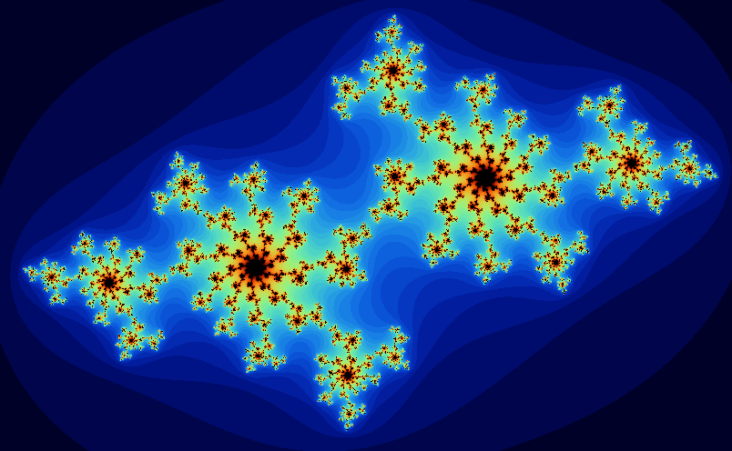

# Fractol
42 Project in a graphics learning curve

## How to build

```
make
```

## How to run

```
./fractol Mandelbrot
```

You can place `Julia` or `Burning-ship` instead of `Mandelbrot` with unsurprising result

## Basic fractals

### Mandelbrot


| Julia  | Julia color zebra |
| ------------- | ------------- |
|   |   |

| Julia dynamic  | Julia zoomed in to a point |
| ------------- | ------------- |
|   |   |

| Burning ship  | Burning ship new color | Burning ship zoomed |
| ------------- | ------------- | ------------- |
|   |   |   |

## Bonus fractals (Newton fractals)

| z^3 - 1 colored by root reached  | z^3 - 1 colored by number of iterations |
| ------------- | ------------- |
|   |   |

| sin(z) - 1 | sin(z) - 1 zoomed in |
| ------------- | ------------- |
| -1.png )  | -1_zoomed_in.png)  |

| z^3 - 1 with complex alpha  | z^3 - 1 with complex alpha number of iterations increased | z^3 - 1 with complex alpha new color |
| ------------- | ------------- | ------------- |
|  |   |    |

